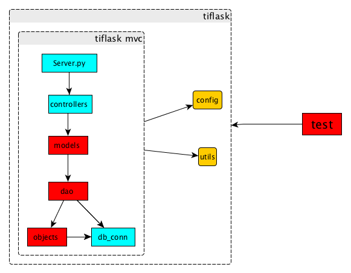

# tiflask 框架

## 概述

  tiflask是基于Flask的模型的，通过MVC编程规则改进而成的编程框架，主要用于模型组各类型的线上服务
  
  主要特色功能，MVC开发架构拆分，配置文件开发测试环境分离，logging规范化，单元测试范例，DB操作封装+自动关闭，常用Utils类的封装, __init__ 的使用方式
  
  整个项目将模拟一个简单场景, 输入用户电话号码, 输出用户总共阅读过多少篇文章, 总共阅读过多少类的文章, 最近3个月总共阅读过多少文章, 最近三个月总共阅读过多少类别的文章，从而给出一个阅读量的评分 
  
  要做新的开发的时候，可以在参照此场景的用例，进行改进，其中标红色部分的 model，dao，objects, 以及外部的test 是开发人员主要的工作量，其他蓝色区域，每次的变动并不是很大，基本Bug只会出现在红色区域
  
  

## 文档列表
[**环境配置**](docs/tiflask-环境配置.md)

[**框架介绍**](docs/tiflask-框架介绍.md)

[**接口文档**](docs/tiflask-接口文档.md)

[**特征列表**](docs/tiflask-用户特征列表.md)

[**连接池访问**](docs/tiflask-连接池.md)

## 注意事项
   * 先构建项目的ReadMe, 描述清楚项目内容,功能，接口输入，输出
   * 最好能先按照需求文档给一版，假的输出，不要让对方等待
   * 从Mysql 或者 Mongo 中读取出的中文字符一般是 unicode 格式的，是否需要进行转码需要看实际情况
   * 新建的单元测试，尤其是数据访问层的Dao
   
   
